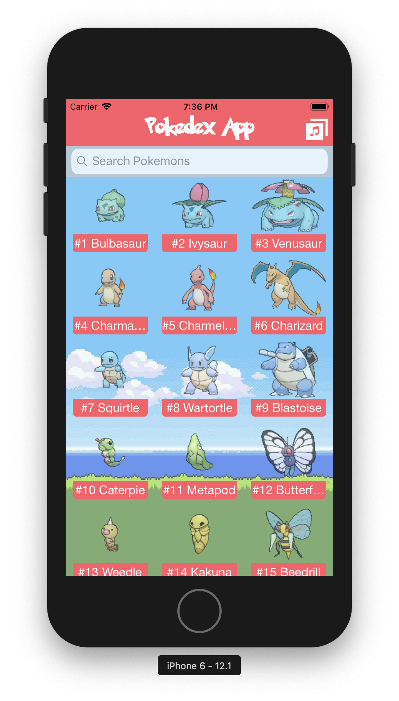
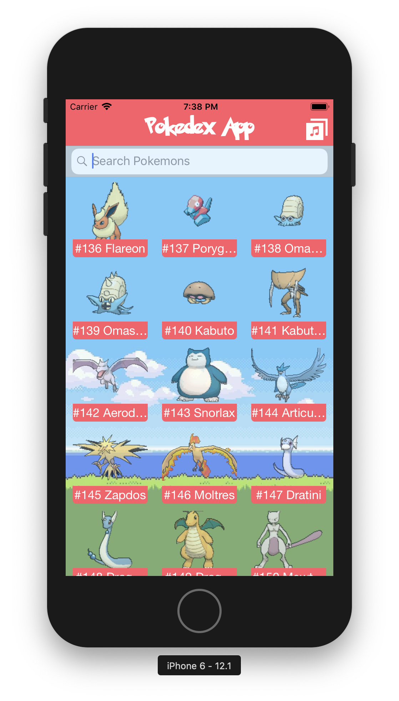
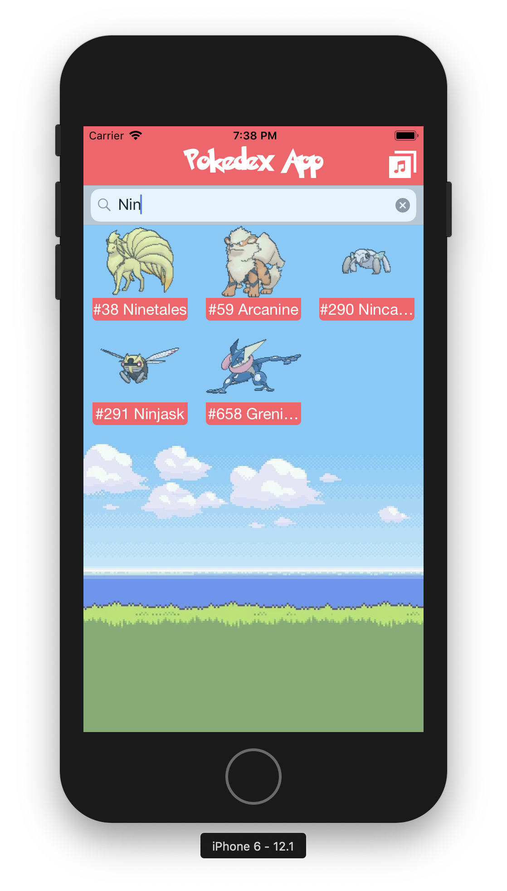

# Pokedex project

This is a project to create a Pokedex app for iOS.

## Screenshots: 

### Main Screen:

This is the screen that appears when you open the app.

This shows a list of pokemons and their images.

In the moment you open the app.. the pokemon song will start playing, you can torn it off/of with the button in the upper right corner.

### Scroll

YOu can scroll through the list of pokemons:

### Search

You can search by Pokemon name or by pokemon number:

